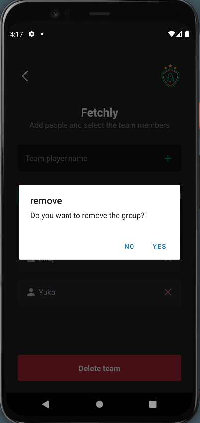

<p align="center">
  
  
  
</p>

<p align="center">
	
	
  
</p>

<div align="center">
  <a href="#memo-project">Project</a>&nbsp;&nbsp;&nbsp;|&nbsp;&nbsp;&nbsp;
  <a href="#rocket-technologies">Technologies</a>&nbsp;&nbsp;&nbsp;|&nbsp;&nbsp;&nbsp;
  <a href="#clipboard-requirements">Requirements</a>&nbsp;&nbsp;&nbsp;|&nbsp;&nbsp;&nbsp;
  <a href="#keyboard-how-to-run-the-project">How to run the project</a>&nbsp;&nbsp;&nbsp;|&nbsp;&nbsp;&nbsp;
</div>

<br>

---

## :memo: Project 

This is the IgniteTeams project, a React Native application that facilitates event organizers in managing guest lists for various events. The application allows organizers to add new guests, check-in attendees, and remove guests from the list.

**Features**
- Add new guests to the list.
- Prevents duplicate guest entries.
- Remove guests from the list with a confirmation prompt.
- Dynamic display of the guest list using a FlatList.
- Informative message when the guest list is empty.

This project was developed during the React Native bootcamp [Ignite](https://github.com/Rocketseat), run by [@Rocketseat](https://github.com/Rocketseat).

<br>

---

## :rocket: Technologies 

This project was developed using the following technologies:

- [React Native](https://reactnative.dev/)
- [Expo](https://docs.expo.dev/)
- [TypeScript](https://www.typescriptlang.org/)

<br>

---

## :clipboard: Requirements

Before starting, ensure you have the following installed:

- [Git](https://git-scm.com)
- [Node.js](https://nodejs.org/en/)
- Expo CLI - Follow the [Expo CLI installation guide](https://docs.expo.io/versions/latest/sdk/notifications/) for setup.

<br>

## :keyboard: How to run the project 

```bash
# Clone this project
$ git clone git@github.com:Ca-byte/igniteteams.git

# Access the project directory
$ cd igniteteams

# Install dependencies
$ npm install

# Run the project
$ npm start

# Once started, follow Expo CLI instructions to launch the app on a simulator/emulator or scan the QR code with the Expo Go app on your physical device.


```

<a href="#top">☝</a>

<p style="text-align: center;">Developed with 💜 by Caroline Vieira</p>